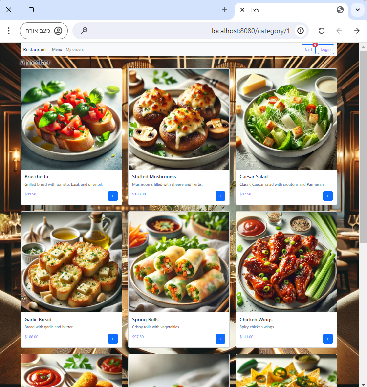

[](https://classroom.github.com/a/hW8nnBf1)

# OH Restaurant - Online Food Ordering Website
<h1>Hadas Maimon and Odaya Attia </h1>
<p>Email: hadasmai@edu.hac.ac.il, Odayaat@edu.hac.ac.il</p>
<p>Hadas Id: 32491744<br> Odaya Id: 346328040 </p>
<h1>Ex5 - Final project</h1>

## doc:
The documentation index.html is in README.html 
## Project Overview

A comprehensive online food ordering website developed using Spring Boot and XAMPP for database management. The project enables users to browse menus, add dishes to their cart, and place orders effortlessly.

## Link demo video 
https://drive.google.com/file/d/1wT7HO3g-RCB_7m1DctxlOPqR4T6bCnmX/view?usp=drive_link

## Features

- User-friendly interface for creating and managing orders.
- Real-time for cart updates.
- Efficient database management with XAMPP.
- Seamless user experience with responsive design.

## Technologies Used

- **Spring Boot**: Backend framework.
- **XAMPP**: Database management.
- **Bootstrap**: Styling and alerts.
- **JavaScript**: Dynamic interactions.
- **HTML & CSS**: Structuring and styling.

## Project Structure

- **Frontend**: HTML, CSS, JavaScript, Bootstrap.
- **Backend**: Spring Boot.
- **Database**: XAMPP.

## Data Structure
The project utilizes a structured list for organizing the menu:
Categories: A list of food categories: "Appetizer", "Dessert", "Main Course", "Drink".
Dishes: Each category contains a list of dishes.

## Key Functionalities

1. User Registration and Login.
2. Menu Browsing.
3. Cart Management with Real-time updates.
4. Order Placement and Processing.

## How to Run the Project

1. **Clone the Repository**:
   ```bash
   git clone https://github.com/yourusername/restaurant.git
   ```


2. **Set Up the Database**:
    - Install XAMPP and start Apache and MySQL.
    - Import the database schema: Create a new database in XAMPP called `ex5`.
    - **⚠️ NOTE: THE DATABASE MUST BE EMPTY THE FIRST TIME! ⚠️**
    - you can see all the tables in: src/main/java/com/example/demo/mocks

3. **Configure the Application**:
    - Update `application.properties` with your database settings.


4. **Run the Application**:
   ```bash
   mvn spring-boot:run
   ```

5. **Access the Application**:
    - Open `http://localhost:8080` in your browser.


## Let's explore the website with us:
**Welcome to our online OH Restaurant**:


**On homePage you find the menu with 4 categories**:


**Appetizer**:



**Main Course**:


**Dessert**:


**Drinks**:


**Every dish that you will pick will be added to your cart**:


**You may see your cart every moment**:


